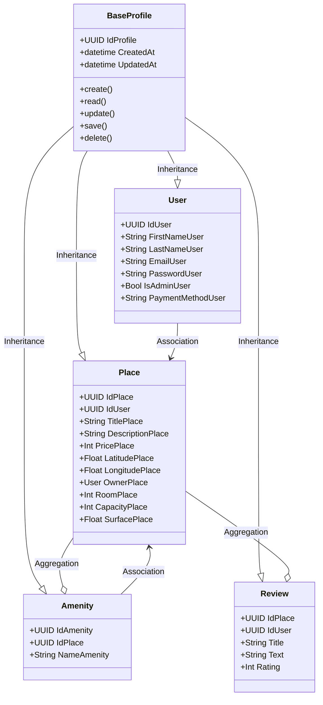

```mermaid
classDiagram

direction TB

class BaseProfile {

+UUID IdProfile

+datetime CreatedAt

+datetime UpdatedAt

+create()

+read()

+update()

+save()

+delete()

}

  

class User {

+UUID IdUser

+String FirstNameUser

+String LastNameUser

+String EmailUser

+String PasswordUser

+Bool IsAdminUser

+String PaymentMethodUser

}

  

class Place {

+UUID IdPlace

+UUID IdUser

+String TitlePlace

+String DescriptionPlace

+Int PricePlace

+Float LatitudePlace

+Float LongitudePlace

+User OwnerPlace

+Int RoomPlace

+Int CapacityPlace

+Float SurfacePlace

}

  

class Review {

+UUID IdPlace

+UUID IdUser

+String Title

+String Text

+Int Rating

}

  

class Amenity {

+UUID IdAmenity

+UUID IdPlace

+String NameAmenity

}

  

BaseProfile --|> User : Inheritance

BaseProfile --|> Place : Inheritance

BaseProfile --|> Review : Inheritance

BaseProfile --|> Amenity : Inheritance

User --> Place : Association

Amenity --> Place : Association

Place --o Amenity : Aggregation

Place --o Review : Aggregation
```