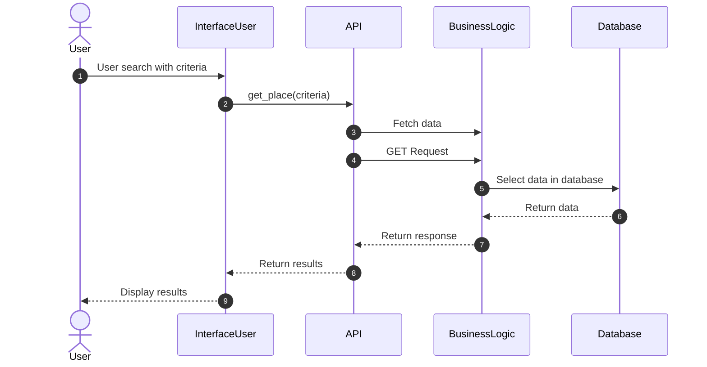

```mermaid
---

config:

look: neo

theme: redux-dark-color

---

sequenceDiagram

actor User as User

autonumber

User ->> InterfaceUser: User search with criteria

InterfaceUser ->> API: get_place(criteria)

API ->> BusinessLogic: Fetch data

API ->> BusinessLogic: GET Request

BusinessLogic ->> Database: Select data in database

Database -->> BusinessLogic: Return data

BusinessLogic -->> API: Return response

API -->> InterfaceUser: Return results

InterfaceUser -->> User: Display results
```
