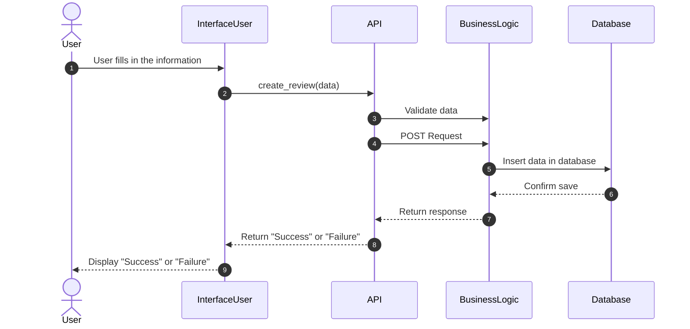

```mermaid
---

config:

look: neo

theme: redux-dark-color

---

sequenceDiagram

actor User as User

autonumber

User ->> InterfaceUser: User fills in the information

InterfaceUser ->> API: create_review(data)

API ->> BusinessLogic: Validate data

API ->> BusinessLogic: POST Request

BusinessLogic ->> Database: Insert data in database

Database -->> BusinessLogic: Confirm save

BusinessLogic -->> API: Return response

API -->> InterfaceUser: Return "Success" or "Failure"

InterfaceUser -->> User: Display "Success" or "Failure"
```