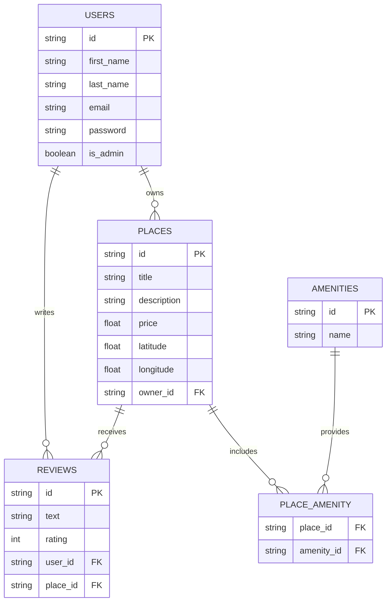

# HBnB - Part 3: Enhanced Backend with Authentication and Database Integration

## **🧭 Overview**

This part of the **HBnB Project** extends the backend of the application by introducing **authentication**, **authorization**, and **database integration**.

It replaces in-memory data storage with a persistent **SQLAlchemy**-based solution using **SQLite** for development and prepares the system for **MySQL** in production.

You will also implement **JWT authentication** for secure API access and **role-based access control** to distinguish between regular users and administrators.

## **🎯 Objectives**

1. **Authentication and Authorization:**
    Implement JWT-based authentication using Flask-JWT-Extended and role-based access control via the is_admin attribute.
    
2. **Database Integration:**
    Replace in-memory storage with **SQLite** using SQLAlchemy ORM and prepare for **MySQL** in production environments.
    
3. **Persistent CRUD Operations:**
    Refactor all CRUD operations to interact directly with the database for long-term data storage.
    
4. **Database Design and Visualization:**
    Use **Mermaid.js** to design and visualize entity relationships between users, places, reviews, and amenities.
    
5. **Data Validation and Consistency:**
    Ensure that data constraints, validation, and referential integrity are properly enforced within all models.

## **🧱 Project Structure**

```tree
part3
├── app
│   ├── api
│   │   ├── __init__.py
│   │   └── v1
│   │       ├── amenities.py
│   │       ├── auth.py
│   │       ├── __init__.py
│   │       ├── places.py
│   │       ├── reviews.py
│   │       └── users.py
│   ├── config.py
│   ├── __init__.py
│   ├── models
│   │   ├── amenity.py
│   │   ├── base_model.py
│   │   ├── __init__.py
│   │   ├── place.py
│   │   ├── review.py
│   │   └── user.py
│   ├── persistence
│   │   ├── __init__.py
│   │   ├── repository.py
│   │   └── sqlalchemy_repository.py
│   ├── services
│   │   ├── facade.py
│   │   └── __init__.py
│   └── tests
│       └── __init__.py
├── diagram.md
├── .gitignore
├── instance
│   ├── development.db
│   └── hbnb_dev.db
├── requirements.txt
├── run.py
└── sql
    ├── data.sql
    └── schema.sql
```

## **🚀 How to Run the Application**

### **1. Clone the Repository**
```bash
git clone https://github.com/<your-username>/holbertonschool-hbnb.git
cd holbertonschool-hbnb/part3
```
### **2. Create and Activate a Virtual Environment**

```bash
python3 -m venv venv
source venv/bin/activate
```
### **3. Install Dependencies**
```bash
pip install -r requirements.txt
```

### **4. Set Up the Database**

For development:
```bash
flask shell
>>> from app import db
>>> db.create_all()
```

For testing with SQLite:
```bash
export FLASK_ENV=development
export DATABASE_URL=sqlite:///hbnb_dev.db
```

### **5. Run the Application**
```bash
flask run.py
```

## **💡 Example Requests**
### **User Registration**

```bash
curl -X POST http://127.0.0.1:5000/api/v1/users \
-H "Content-Type: application/json" \
-d '{"first_name": "John", "last_name": "Doe", "email": "john@example.com", "password": "123456"}'
```

### **User Login**

```bash
curl -X POST http://127.0.0.1:5000/api/v1/login \
-H "Content-Type: application/json" \
-d '{"email": "john@example.com", "password": "123456"}'
```

_Response:_
```json
{
  "access_token": "your.jwt.token.here"
}
```

### **Access Protected Endpoint**

```bash
curl -X GET http://127.0.0.1:5000/api/v1/places \
-H "Authorization: Bearer your.jwt.token.here"
```

## **🧰 Technologies Used**

- **Python 3**
- **Flask** – Web framework
- **Flask-JWT-Extended** – Authentication
- **Flask-Bcrypt** – Password hashing
- **Flask-SQLAlchemy** – ORM for database interaction
- **SQLite / MySQL** – Database systems
- **Mermaid.js** – Database visualization
- **cURL / Postman** – API testing tools

## **🗂️ Database Diagram (Mermaid.js Example)**



## 👷🏼‍♂️👷🏼‍♂️👷🏼‍♂️ Authors

**Christophe Barrère**
**Malik Bouanani**
**Jérémy LAURENS**
